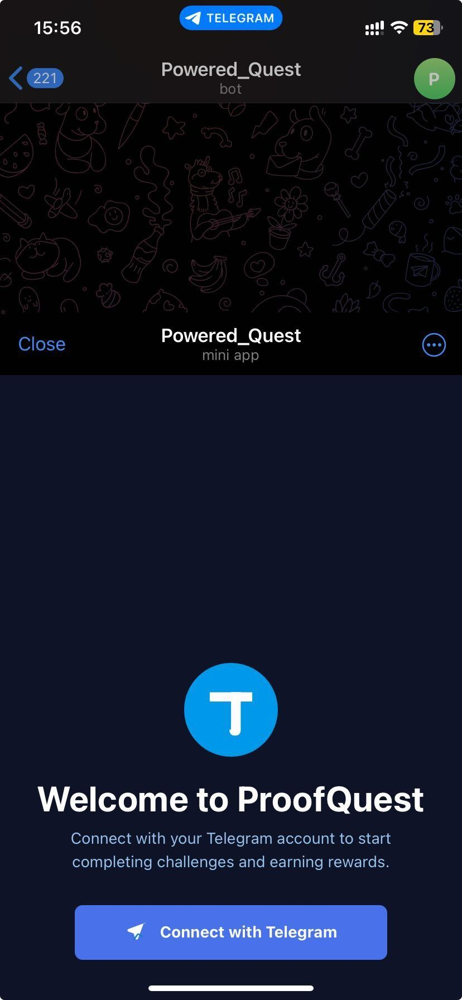
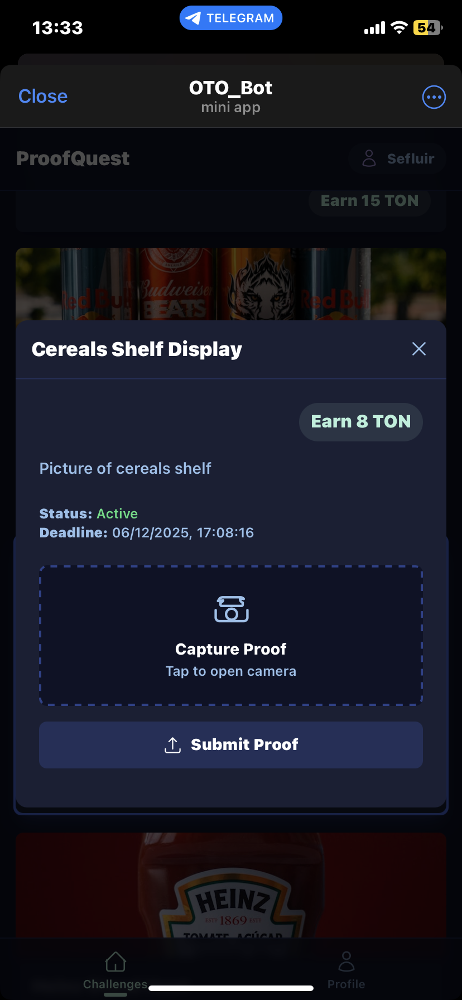
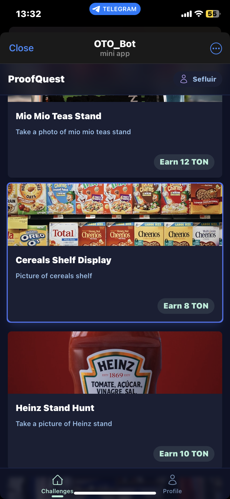
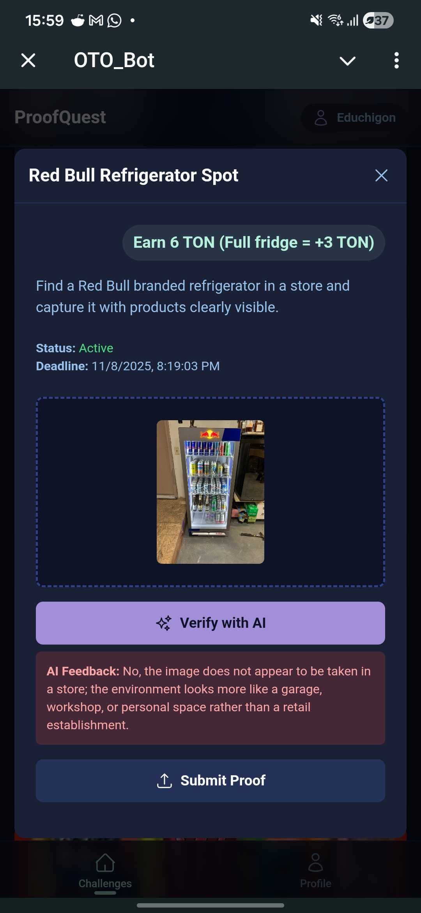
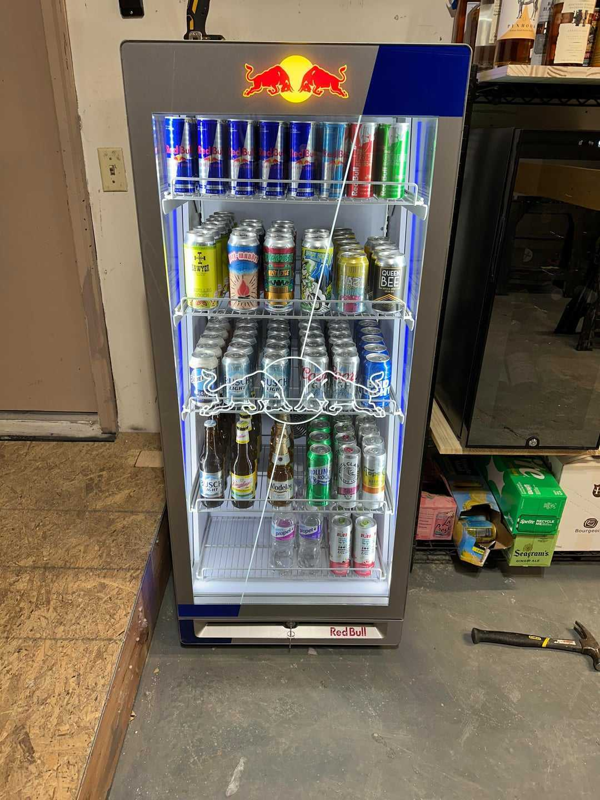
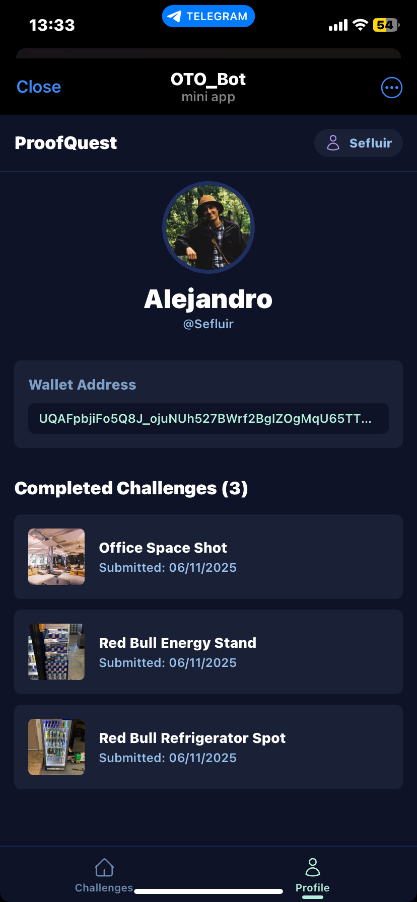

# ProofQuest

A Telegram Mini App that enables users to complete brand challenges by submitting photo proofs of products in stores. The application integrates with TON Connect for wallet functionality and uses AI-powered verification for submissions.

## Second Place Winner - TON x 42 Berlin November 2025 Hackathon

We are proud to announce that ProofQuest won **2nd place** at the [TON x 42 Berlin Hackathon](https://www.linkedin.com/posts/ton-europe-hub_ton-x-42-berlin-hackathon-day-2-recap-activity-7392596683915919360-Lvjy?utm_source=share&utm_medium=member_desktop)!

### Team Members

- **Eduardo** - [GitHub](https://github.com/educhigon)
- **Alicia** - [GitHub](https://github.com/maimbet)
- **Tanmay** - [GitHub](https://github.com/tpandya42)
- **Alejo** - [GitHub](https://github.com/faramirezs)

## Demo video (click to reproduce)

[](https://youtube.com/shorts/nMve70RHvBc?si=u6wHI2cOVMMI_p9-)


## Application Screenshots

<p align="center">
  
  
  
</p>

<p align="center">
  
  
  
</p>

## Overview

ProofQuest is a full-stack web application designed for the Telegram ecosystem. Users can browse active brand challenges, submit photos as proof of completion, and connect their TON wallet to manage rewards. The platform features AI-powered image verification to ensure submission authenticity.

## Architecture

```
[Telegram Mini App (React Frontend)]
            |
            v
  [FastAPI Backend API]
            |
            v
[PostgreSQL Database (TimescaleDB)]
```

## Key Features

- **Telegram Authentication**: Seamless login using Telegram Mini App credentials
- **TON Wallet Integration**: Connect TON wallets via TON Connect SDK
- **Challenge System**: Browse and participate in active brand challenges
- **Photo Submissions**: Upload proof photos for challenge completion
- **AI Verification**: Automated verification of submissions using Google's Gemini AI
- **User Profiles**: Track submission history and wallet connections
- **Leaderboard**: View top participants based on submission counts

## Technology Stack

### Frontend
- React 19 with TypeScript
- Vite for build tooling
- TON Connect UI for wallet integration
- Google Generative AI SDK
- Telegram WebApp SDK

### Backend
- FastAPI (Python)
- PostgreSQL with TimescaleDB
- psycopg2 for database connectivity
- SQLAlchemy for ORM
- Hosted on Render

### Database
- PostgreSQL 17+
- TimescaleDB on Tiger Cloud
- Comprehensive indexing for performance
- Referential integrity with foreign keys

## Project Structure

```
ProofQuest/
├── backend/               # FastAPI backend application
│   ├── main.py           # API endpoints and application logic
│   ├── database.py       # Database connection and models
│   ├── requirements.txt  # Python dependencies
│   └── create_schema.py  # Database schema setup
├── frontend/             # React frontend application
│   ├── App.tsx          # Main application component
│   ├── types.ts         # TypeScript type definitions
│   ├── components/      # React components
│   └── backend/         # API integration layer
└── README.md            # This file
```


## Quick Start

### Prerequisites

- Node.js (v16 or higher)
- Python 3.10+
- PostgreSQL database (or Tiger Cloud account)
- Telegram account for testing
- Gemini API key for AI verification

### Backend Setup

1. Navigate to the backend directory:
   ```bash
   cd backend
   ```

2. Install Python dependencies:
   ```bash
   pip install -r requirements.txt
   ```

3. Set up environment variables (create `.env` file):
   ```
   TIMESCALE_SERVICE_URL=your_database_url
   ```

4. Initialize the database schema:
   ```bash
   python create_schema.py
   ```

5. Run the development server:
   ```bash
   uvicorn main:app --reload
   ```

The API will be available at `http://localhost:8000` with interactive documentation at `http://localhost:8000/docs`.

### Frontend Setup

1. Navigate to the frontend directory:
   ```bash
   cd frontend
   ```

2. Install dependencies:
   ```bash
   npm install
   ```

3. Configure environment variables (create `.env.local` file):
   ```
   GEMINI_API_KEY=your_gemini_api_key
   ```

4. Start the development server:
   ```bash
   npm run dev
   ```

The application will be available at `http://localhost:5173`.

## Core Concepts

### Users
Users authenticate via Telegram Mini App credentials. Each user has a unique `telegram_id` and can optionally connect a TON wallet address for future reward functionality.

### Challenges
Brand challenges are time-limited opportunities for users to submit proof photos. Each challenge includes:
- Title and description
- Reference image
- Reward information
- Deadline
- Status (active/expired)

### Submissions
Users can submit one photo per challenge. Submissions are processed through AI verification to ensure they meet challenge requirements. Each submission is linked to both a user and a challenge.

### Verification
AI-powered verification uses Google's Gemini model to analyze submission photos against challenge requirements. The system logs verification attempts, results, and performance metrics.

## API Endpoints

When server is running, interactive docs can be accesible from `/docs`:


### Health & Info
- `GET /` - API information
- `GET /health` - Health check

### Users
- `POST /users/login` - Login or register user
- `POST /users/wallet` - Link TON wallet address

### Challenges
- `GET /challenges` - Get all active challenges
- `GET /challenges/{challenge_id}` - Get specific challenge details

### Submissions
- `POST /submissions` - Submit photo for a challenge
- `GET /submissions/user/{telegram_id}` - Get user's submissions

### Analytics
- `GET /leaderboard` - Get top users by submission count
- `GET /stats` - Get platform statistics

## Deployment

### Backend Deployment (Render)

The backend is configured for deployment on Render using the included `render.yaml` configuration file.

1. Push code to GitHub
2. Connect repository to Render
3. Set environment variables in Render dashboard
4. Deploy service

Production URL: `https://your-app.onrender.com`

### Frontend Deployment

The frontend can be deployed to any static hosting service (Vercel, Netlify, GitHub Pages, etc.) or served through Telegram's hosting for Mini Apps.

## Database Schema

The database uses a normalized schema with four main tables:

- **users**: Telegram user information and wallet addresses
- **challenges**: Brand challenge definitions
- **submissions**: User photo submissions
- **verification_logs**: AI verification audit trail

All tables include proper indexing, foreign key constraints, and timestamp tracking.

## Security Considerations

- No password storage (uses Telegram authentication)
- Environment variables for sensitive data
- CORS configuration for Telegram Mini App
- Database credentials stored securely
- SQL injection prevention through parameterized queries

## Performance Optimizations

- Database indexing on frequently queried columns
- Cache control headers to prevent stale data
- Connection pooling for database efficiency
- Optimized query patterns with proper joins
- Response size optimization

## Testing

### Backend Tests
```bash
cd backend
python test_api.py
```

### Frontend Development
Test in Telegram's Web App environment or use the Telegram Web App simulator.

## Documentation

Detailed documentation is available in each component directory:

- [Backend README](backend/README.md) - Backend setup and API details
- [Frontend README](frontend/README.md) - Frontend setup and components
- [API Documentation](backend/API_DOCUMENTATION.md) - Complete API reference
- [Database Schema](backend/DATABASE_SCHEMA.md) - Database structure and queries
- [Deployment Guide](backend/DEPLOYMENT_QUICKSTART.md) - Deployment instructions

## Contributing

1. Fork the repository
2. Create a feature branch
3. Make your changes
4. Test thoroughly
5. Submit a pull request

## License

This project is private and proprietary.

## Support

For issues or questions, please refer to the documentation in the respective component directories or contact the development team.

## Acknowledgments

- Telegram for the Mini App platform
- TON Foundation for TON Connect SDK
- TimescaleDB for database hosting
- Google for Gemini AI API
- Render for backend hosting
